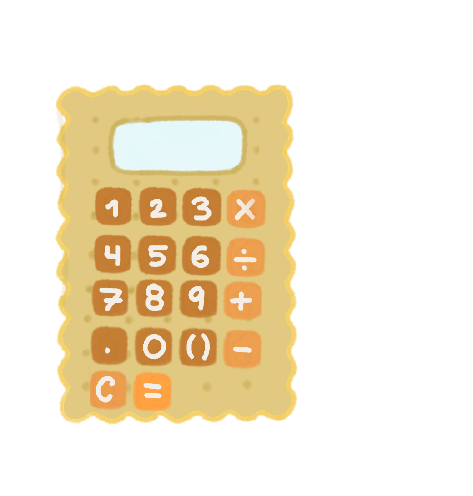

# 🍪 Cookie Calculator

A biscuit-themed desktop calculator made with Python and Tkinter.

A calculator that looks like a cookie. Or a cookie that can do math while looking like a calculator. 🍪



---

## ✨ Features

- **Basic Arithmetic:** Addition, subtraction, multiplication, and division.
- **Decimal Support:** Perform calculations using decimal numbers.
- **Parentheses:** Supports parentheses for more complex expressions.
- **Keyboard Support:** Enter numbers and operations directly from your keyboard.
- **Backspace:** Remove the most recently entered character.
- **Expression Scrolling:** Scroll through longer expressions that do not fit on the calculator display.
- **Error Handling:** Handles invalid expressions and division-by-zero cases.
- **Custom UI:** A hand-designed biscuit/cookie-inspired interface.

---

## 🛠️ Technologies Used

- **Python 3**
- **Tkinter** - Desktop graphical user interface
- **AST (`ast`)** - Safe parsing of mathematical expressions
- **Math (`math`)** - Mathematical utilities and validation
- **Operator (`operator`)** - Performs arithmetic operations
- **Pathlib (`pathlib`)** - Handles the calculator design image file

---

## 🚀 Getting Started

### Prerequisites

Make sure you have **Python 3** installed on your computer.

Tkinter is included with most standard Python installations.

### 1. Clone the repository

```bash
git clone https://github.com/papql/CookieCalculator.git

### 2. Navigate to the project folder
```bash
cd CookieCalculator

### 3. Run the calculator
```bash
python biscuit_calculator.py

Note: biscuit_design.png must remain in the same folder as biscuit_calculator.py for the calculator design to load correctly.

### 📁 File Structure
CookieCalculator/
├── biscuit_calculator.py    # Main calculator program
├── biscuit_design.png       # Biscuit calculator artwork
└── README.md                # Project documentation

### ⌨️ Keyboard Shortcuts
The calculator can also be controlled using the keyboard:

Key	Actions
- 0-9	Enter numbers
- + - * /	Arithmetic operations
- .	Decimal point
- ( )	Parentheses
- Enter	Calculate
- Backspace	Delete the last character
- Escape	Clear calculator
- ← →	Scroll through long expressions

💡 About the Project

I originally made this calculator in Grade 11 as a small programming project. I recently started learning more about GitHub and decided to clean it up and share it here.

The original goal was simple: make a functional calculator, but I was craving cookies and wanted to give it a more fun and creative design instead of making another standard calculator interface.

🍪 Why make a normal calculator when you can make a biscuit calculator?

### 🦭 Issues & Feedback

If you find a bug or have an idea for a feature, feel free to open an issue!

### 📄 License

This project is open source.

Feel free to use, modify, and learn from the code.

Enjoy using Cookie Calculator! 🍪
